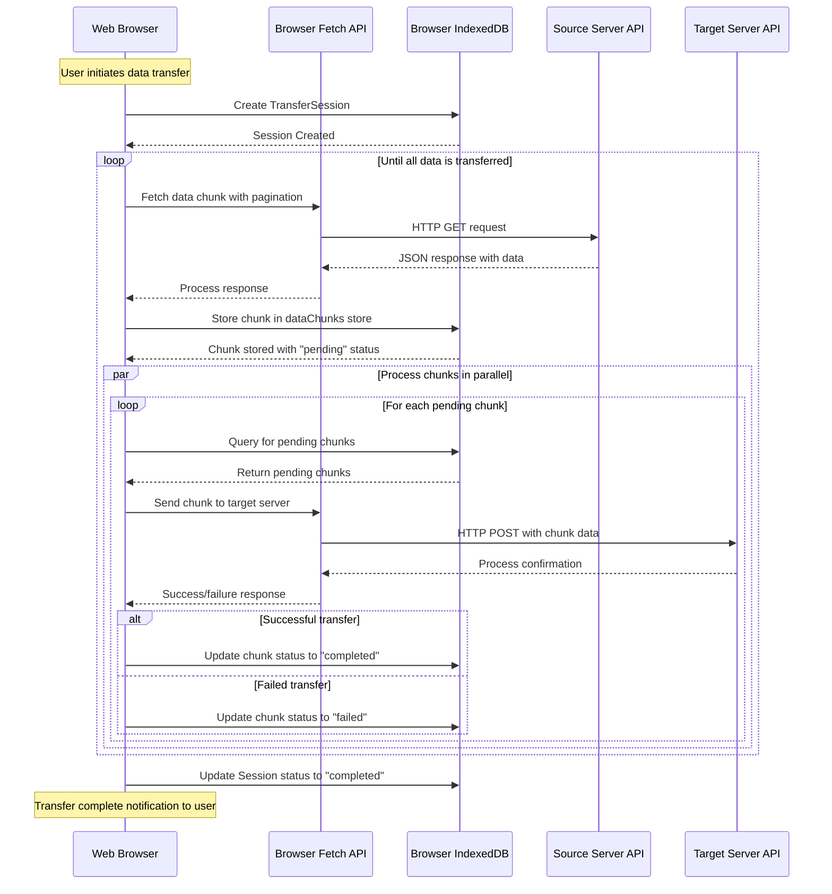

# Browser-Based Data Transfer System

This repository contains a browser-based data transfer system that enables efficient movement of data between disparate systems using the browser as an intermediary with persistence capabilities.

## Project Overview

The browser-based data transfer system provides a solution for transferring large datasets between systems by leveraging browser capabilities for:

- Data fetching and submission via the Fetch API
- Persistent storage using IndexedDB
- Resilient processing with automatic retry mechanisms
- Pause/resume capability for long-running transfers
- Progress tracking and user feedback

## Architecture Documentation

The system architecture is documented through a series of diagrams that explain different aspects of the implementation. All diagrams use [Mermaid](https://mermaid-js.github.io/) syntax, which can be rendered in GitHub, VSCode (with plugins), or using the Mermaid Live Editor (https://mermaid.live/).



### Available Diagrams

1. [System Architecture](data-transfer-mfe/diagrams/1-system-architecture.mmd)
   - Detailed sequence diagram showing interactions between system components

2. [IndexedDB Schema](data-transfer-mfe/diagrams/2-indexeddb-schema.mmd)
   - Class diagram showing the database schema for persistence

3. [Chunk State Machine](data-transfer-mfe/diagrams/3-chunk-state-machine.mmd)
   - State transitions for data chunks throughout the processing lifecycle

4. [Event-Driven Flow](data-transfer-mfe/diagrams/4-event-driven-flow.mmd)
   - Flowchart illustrating the event-driven architecture

5. [Browser APIs Integration](data-transfer-mfe/diagrams/5-browser-apis-integration.mmd)
   - Detailed sequence diagram showing interactions with browser APIs

6. [IndexedDB Operations](data-transfer-mfe/diagrams/6-indexeddb-operations.mmd)
   - Sequence diagram for database operations

7. [State Management](data-transfer-mfe/diagrams/7-state-management.mmd)
   - State diagram for session status with pause/resume logic

8. [Event-Driven Components](data-transfer-mfe/diagrams/8-event-driven-components.mmd)
   - Class diagram showing the event-driven components

9. [Flow Summary](data-transfer-mfe/diagrams/9-flow-summary.mmd)
   - High-level graph summary of the data transfer flow

10. [Architecture Description](data-transfer-mfe/diagrams/architecture-description.md)
    - Detailed explanation of the architecture, including context, problem statement, and solution approach

## Repository Structure

- `data-transfer-mfe/` - Main implementation of the browser-based transfer system
- `express-server/` - Example source server implementation
- `express-receiver/` - Example target server implementation
- `shell/` - Application shell for hosting the micro-frontend
- `generic-service-mfe/` - Generic service micro-frontend
- `data/` - Sample data files

## Getting Started

To run the system locally:

1. Start the source server:
   ```
   cd express-server
   npm install
   npm start
   ```

2. Start the target server:
   ```
   cd express-receiver
   npm install
   npm start
   ```

3. Start the application shell:
   ```
   cd shell
   npm install
   npm start
   ```

4. Navigate to http://localhost:3000 to access the application

## Key Features

- Event-driven architecture for efficient resource utilization
- Chunked data processing for handling large datasets
- Parallel processing with controlled concurrency
- Persistent state management for resilience
- Progress tracking and status reporting 